# AIED-research demo page

### 페이지 미리보기


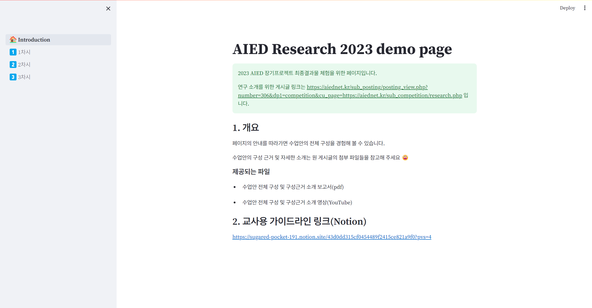

#### [1차시]
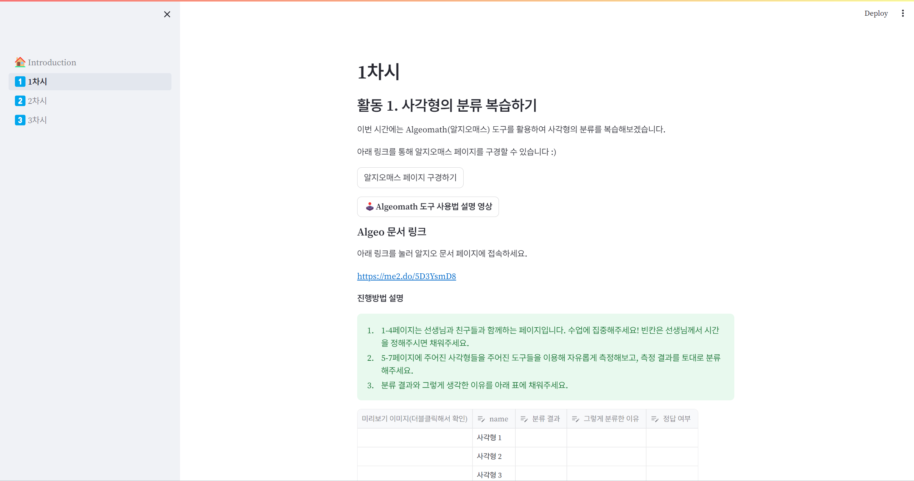

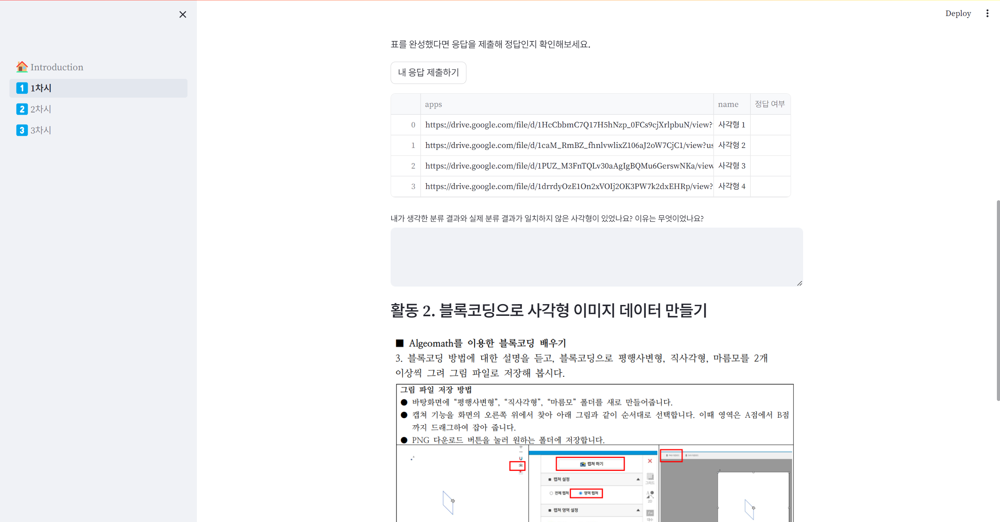

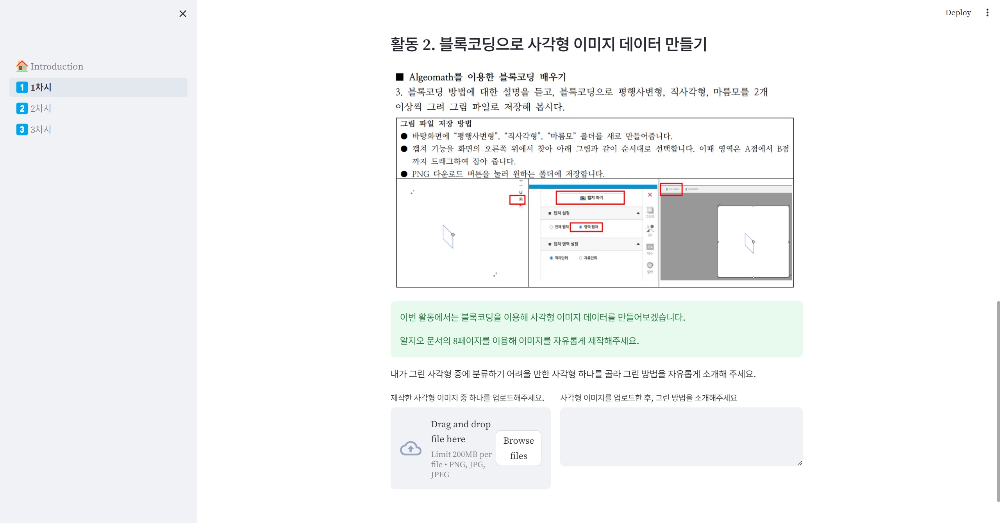

#### [2차시]
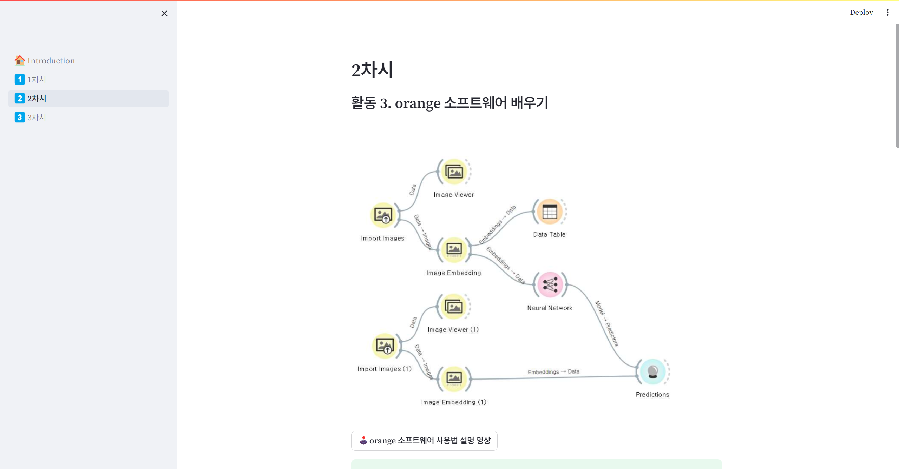

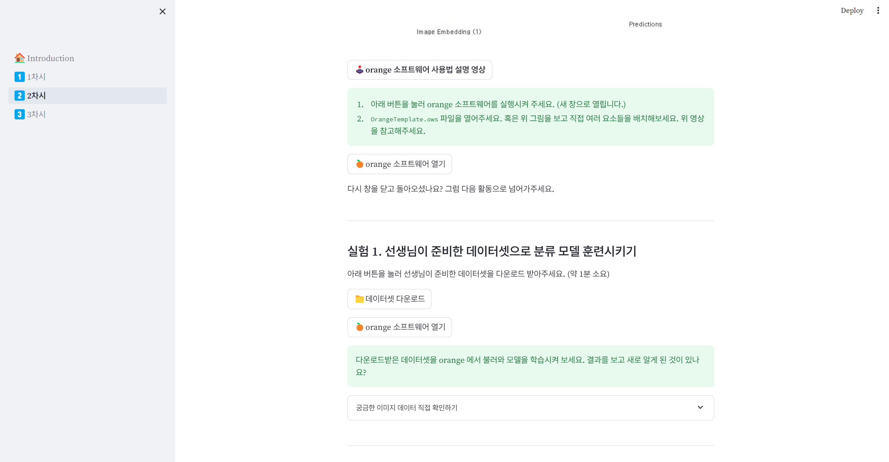

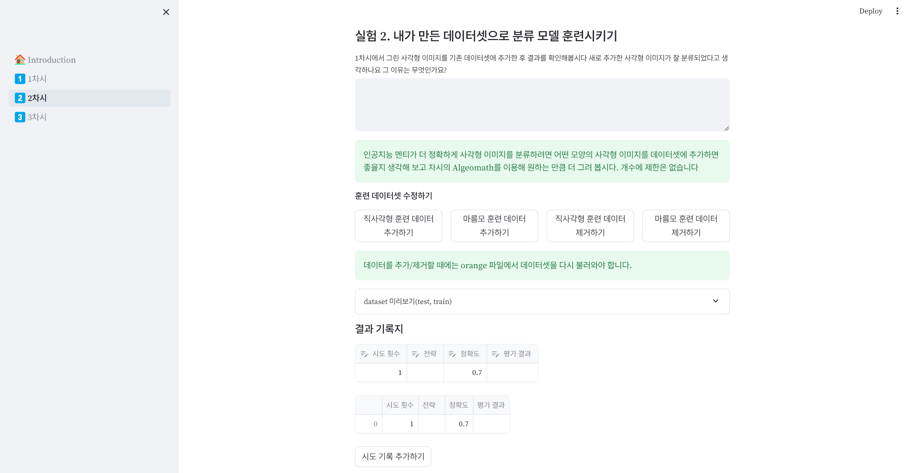

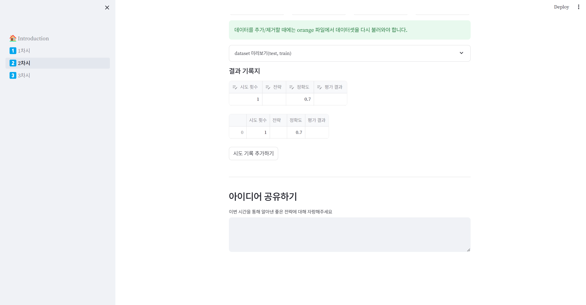

#### [3차시]

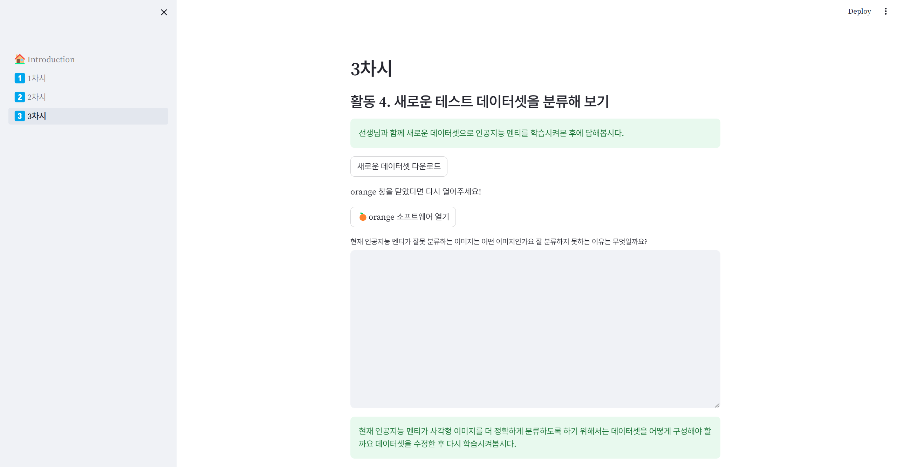

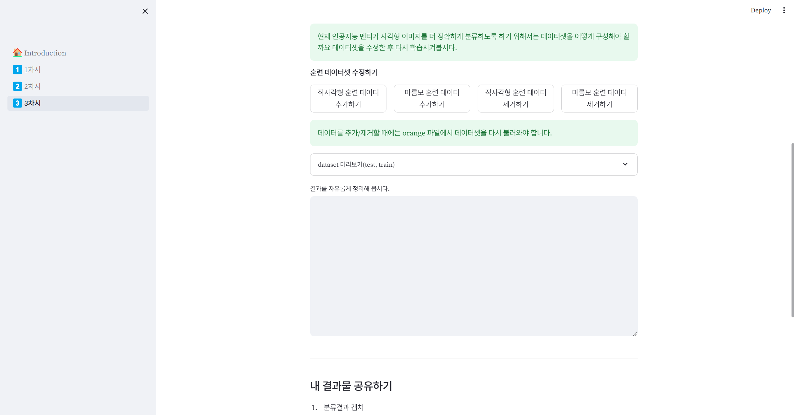

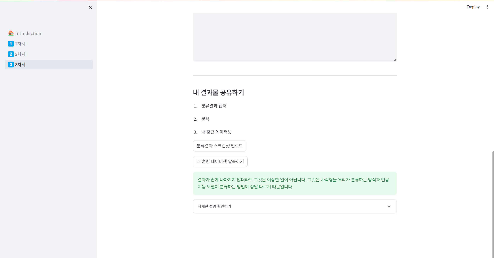

### 실행 전 확인!

사용할 개인 pc는 conda 가 설치되어 있어야 합니다. 

>  conda 설명, window에 설치하는 방법: https://m.blog.naver.com/jonghong0316/221683053696 


conda 설치 유무 확인:
```
conda --version
```
conda 22.9.0 과 같이 버전이 출력되면 설치되어 있는 것입니다.

> 
### 빠르게 실행하기
아래 코드를 이용해 이 repo를 로컬 컴퓨터에 복사해줍니다
```
git clone https://github.com/cherry-0/AIED-research-demo.git
```

그 후 복사된 폴더로 이동해줍니다.
```
cd AIED-research-demo
```

`start.sh` 파일을 실행해줍니다. 그럼 시작할 준비가 완료됩니다! 
```
./start.sh
```
아래 그림과 같이 웹 브라우저 링크가 뜨면 URL을 클릭해서 접속하시면 됩니다. 


혹시 에러가 생긴다면 Issues 탭에 에러 메세지 전체를 올려 주시면 빠르게 조치하겠습니다!


### Proceeding full text:
https://github.com/cherry-0/Streamlit-Orange-demo 


